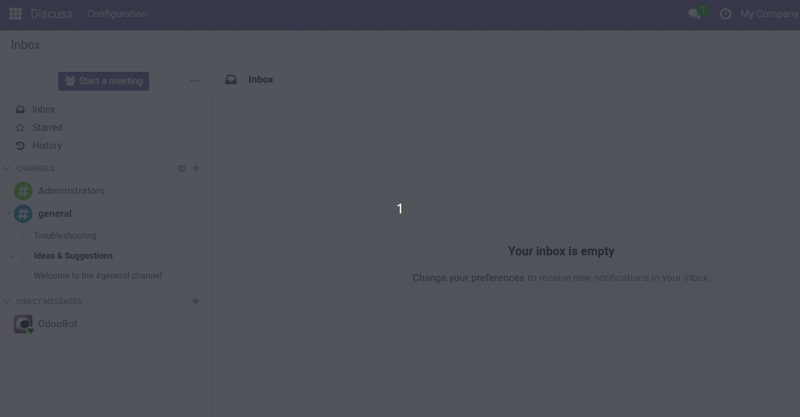

- This module depends on
  [stock_warehouse_calendar](https://github.com/OCA/stock-logistics-warehouse)
- Go to *Settings* and activate the developer mode.

- Go to *Settings \> Technical \> Resource \> Working Schedules* and define
  your resource calendar.

- Go to *Inventory \> Configuration \> Warehouse Management \>
  Warehouses* and assign the Working Schedule.

